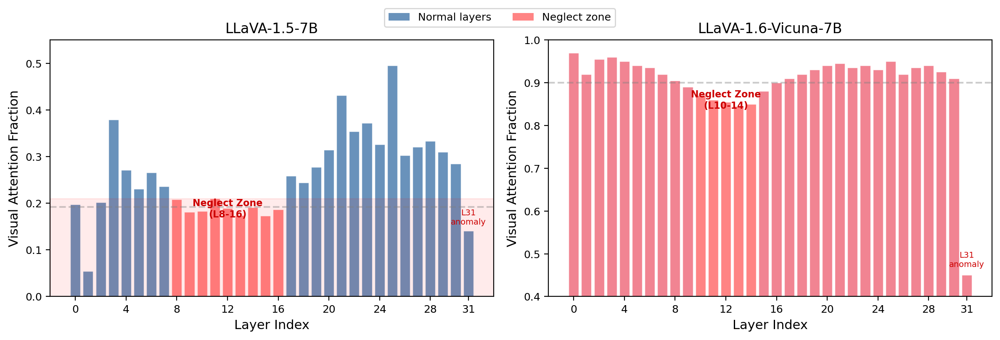
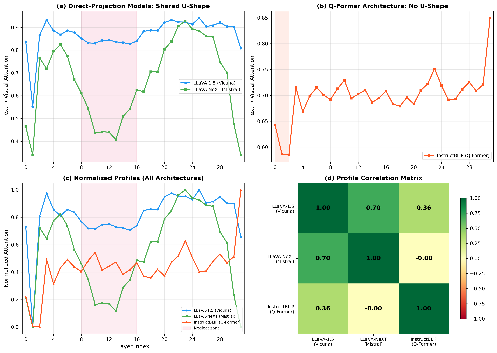
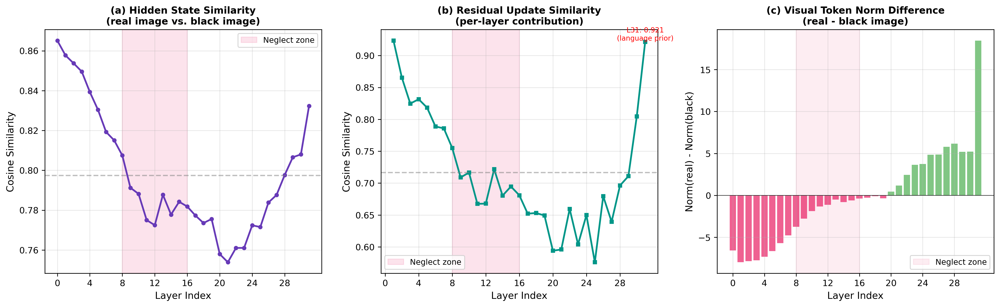
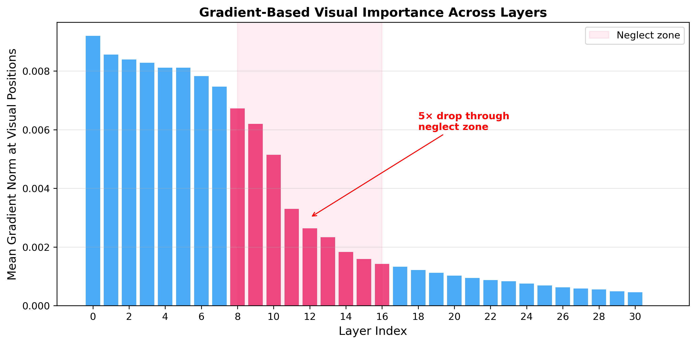

# VIAR: Vision-Informed Attention Rebalancing

**A structural mechanistic analysis of visual attention allocation in Vision-Language Models**

[]()
[]()

<p align="center">
  
</p>

## Key Discovery: The Visual Neglect Zone

We discover and characterize the **visual neglect zone** — a systematic pattern in direct-projection VLMs where middle transformer layers allocate disproportionately low attention to visual tokens. This creates a U-shaped attention curve across layers that is:

- **Architecture-independent**: Present in LLaVA-Vicuna and LLaVA-Mistral (r=0.70 correlation)
- **Absent in Q-Former models**: InstructBLIP shows no U-shape (r=-0.005 with LLaVA-Mistral)
- **Causally relevant**: A minimal attention-bias intervention shifts POPE yes-ratio from 42.8% to 50.0%
- **Validated by three independent methods**: Attention analysis, gradient attribution, and hidden-state comparison

<p align="center">
  
</p>

## Results Summary

### Cross-Architecture Analysis (4 models)

| Model | Architecture | U-Shape | Neglect Zone | L31 Behavior |
|-------|-------------|---------|-------------|--------------|
| LLaVA-1.5-7B (Vicuna) | Direct projection | Yes | L8-16 | Crash (0.808) |
| LLaVA-NeXT-7B (Mistral) | Direct projection | Yes | L10-16 | Crash (0.339) |
| InstructBLIP (Q-Former) | Q-Former | No | - | Highest (0.850) |
| Qwen2-VL-7B | ViT + projection | Flat | - | - |

### POPE Benchmark

| Method | Accuracy | Yes Ratio | Brier Score |
|--------|----------|-----------|-------------|
| Baseline | 83.6% | 42.8% | 0.123 |
| **VIAR** (b=2.0, L8-16) | **84.4%** | **50.0%** | **0.122** |
| VCD (alpha=1.0) | 79.0% | 62.2% | - |

### Bayesian Analysis (9K POPE)

- P(VIAR improves accuracy) = 67.8% (inconclusive)
- **P(VIAR shifts yes-ratio) = 99.95%** (definitive)
- Cohen's h (yes-ratio): 0.049
- Yes-ratio 95% credible interval: [+1.0%, +3.8%]

## Mechanistic Evidence

### Language Prior Collapse

Layer 31's residual update has **0.922 cosine similarity** between real and null image conditions — it processes text nearly identically regardless of visual input. This is definitive evidence that the final layer functions as a language-prior readout.

<p align="center">
  
</p>

### Gradient Attribution

Gradient-based visual importance drops **5x through the neglect zone** (L8-16), independently confirming that visual information becomes less behaviorally relevant in these layers.

<p align="center">
  
</p>

### Per-Sample Effects at Zone Boundary

While overall per-sample correlation between neglect depth and hallucination is not significant (r=-0.023), the **transition layers L14-17 show significant per-sample effects** (L14: r=-0.154, p=0.0005), suggesting individual hallucination vulnerability manifests where the model exits the neglect zone.

## Method: VIAR

VIAR is a training-free, inference-time intervention that adds an additive bias to pre-softmax attention scores at visual token positions in the neglect zone:

```
M̃[:,:,:,1:nv] = M[:,:,:,1:nv] + b
```

where M is the 4D causal attention mask and b > 0 is a scalar bias. Applied to layers 8-16 with b=2.0 for LLaVA-1.5-7B.

**Key properties:**
- No additional parameters or training
- Compatible with eager, SDPA, and flash attention
- Negligible computational overhead
- Designed as a diagnostic probe, not a production method

## Repository Structure

```
.
├── paper/
│   ├── main.tex              # Full paper (LNCS/Springer format)
│   ├── main.pdf              # Compiled PDF
│   ├── references.bib        # Bibliography
│   └── llncs.cls             # LNCS document class
├── src/
│   ├── eval_upgrade.py       # Main experiments (Modal deployment)
│   ├── eval_review2.py       # Head-level + threshold + InstructBLIP
│   ├── eval_revision.py      # Phase 1 experiments
│   ├── eval_extended.py      # Phase 2 experiments
│   └── viar.py               # Core VIAR implementation
├── results/                  # All experimental results (JSON)
│   ├── upgrade_llava_mechanistic.json     # Collapse + gradient + correlation
│   ├── upgrade_llava_mistral_profile.json # LLaVA-Mistral attention
│   ├── upgrade_qwen2vl_profile.json       # Qwen2-VL attention
│   ├── instructblip_analysis.json         # InstructBLIP attention
│   ├── head_level_analysis.json           # 32x32 head-level matrix
│   ├── threshold_comparison.json          # 9K POPE threshold sweep
│   ├── power_analysis.json                # Effect sizes + Bayesian
│   └── ...                                # Additional results
└── figures/                  # All figures (PDF + PNG)
    ├── fig1_multimodel_attention.*
    ├── fig12_cross_architecture.*
    ├── fig13_language_prior_collapse.*
    ├── fig14_gradient_attribution.*
    ├── fig15_persample_correlation.*
    └── ...
```

## Reproducing Results

All experiments run on Modal (A100 GPUs). To reproduce:

```bash
# Install dependencies
pip install modal

# Deploy experiments
modal deploy src/eval_upgrade.py

# Spawn experiments (run in parallel)
python -c "
import modal
modal.Function.from_name('viar-upgrade', 'llava_mechanistic').spawn()
modal.Function.from_name('viar-upgrade', 'llava_mistral_profile').spawn()
modal.Function.from_name('viar-upgrade', 'qwen2vl_profile').spawn()
"
```

## Citation

```bibtex
@inproceedings{viar2026,
  title={VIAR: Vision-Informed Attention Rebalancing for Training-Free Visual Grounding in VLMs},
  author={Anonymous},
  booktitle={European Conference on Computer Vision (ECCV)},
  year={2026}
}
```

## Honest Reporting

This paper is committed to transparent reporting:

- Accuracy improvements are **not statistically significant** (p=0.132 on 9K POPE)
- VIAR's behavioral effect is **equivalent to threshold tuning** at matched yes-ratios
- The primary contribution is **diagnostic**: characterizing the neglect zone as a structural property
- All null results (GQA, LLaVA-1.6, HallusionBench) are reported
- Effect sizes are very small (Cohen's h = 0.007 for accuracy)
- The study would need >325K samples to achieve 80% power for the accuracy effect

The value of this work is the mechanistic finding, not the intervention.

## License

MIT
